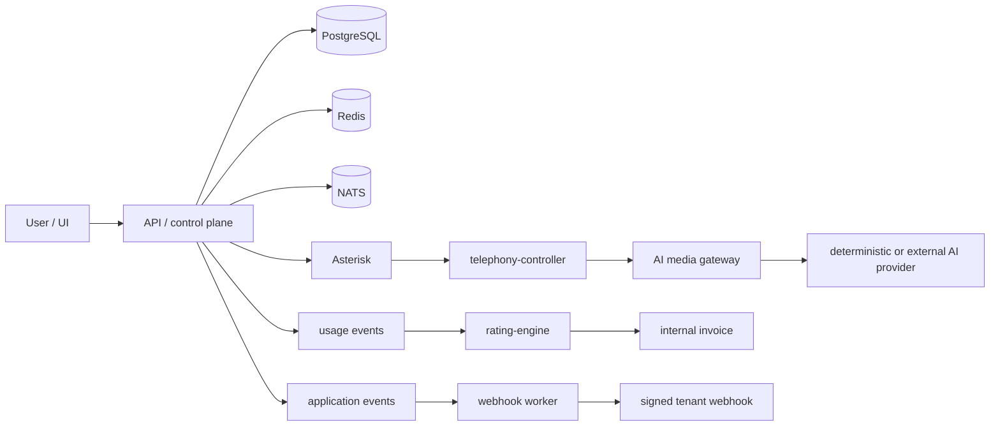

# PBX Platform

Multi-tenant virtual PBX platform with Asterisk/PJSIP telephony, multi-customer isolation, extension and call management, realtime AI media architecture, barge-in and human transfer, usage metering, rating and internal invoicing, tenant and platform-administration UI, API keys, signed webhooks, and deployment and operations assets.

Production-v1 implementation is complete through the external-integration boundary. Live OpenAI, PSTN and Stripe verification remain required before controlled production deployment.

## Current status

### Implemented and verified

| Capability | Status |
|------------|--------|
| Multi-tenant control plane | PASS |
| Authentication and permissions | PASS |
| PostgreSQL RLS | PASS |
| Encrypted credential storage | PASS |
| Internal SIP extension registration | PASS |
| Extension-to-extension calls | PASS |
| RTP media | PASS |
| ARI call tracking | PASS |
| Full call lifecycle and call legs | PASS |
| Deterministic realtime AI media | PASS |
| Barge-in | PASS |
| Tool invocation | PASS |
| Human transfer | PASS |
| Usage metering | PASS |
| Rating and internal invoices | PASS |
| Tenant UI | PASS |
| Platform Owner UI | PASS |
| API applications and keys | PASS |
| Signed outbound webhooks | PASS |
| Local demo workflow | PASS |
| DigitalOcean deployment assets | PASS |
| Backup, restore, monitoring and rollback assets | PASS |
| Platform Owner credential management | PASS |
| Runtime credential resolver | PASS |

### Implemented but awaiting live verification

| Capability | Status |
|------------|--------|
| OpenAI Realtime | NOT_TESTED |
| Real SIP carrier / PSTN inbound and outbound | NOT_TESTED |
| Stripe test-mode lifecycle | NOT_TESTED |

### Not performed or deferred

| Capability | Status |
|------------|--------|
| DigitalOcean deployment | NOT_PERFORMED |
| Stripe live payments | NOT_IMPLEMENTED |
| Production PSTN verification | NOT_PERFORMED |
| High availability | NOT_IMPLEMENTED |
| Multi-region deployment | NOT_IMPLEMENTED |
| Compliance certification | NOT_PERFORMED |
| WebRTC browser softphone | NOT_IMPLEMENTED |

## Architecture

### Principal components

```text
apps/api                    NestJS control plane API
apps/web                    Next.js tenant and platform-admin UI
apps/worker                 Background jobs (webhook delivery)
services/telephony-controller   Asterisk ARI integration (Go)
services/ai-media-gateway       Realtime AI audio (Go)
services/rating-engine          Usage rating (Go)
packages/contracts          Shared types, permissions, API schemas
packages/database           Drizzle ORM schema and migrations
packages/provider-sdk       Provider adapter interfaces
packages/telephony-config   Asterisk config generation
infrastructure/asterisk     Asterisk configs and generated tenant configs
infrastructure/docker       Local and production Docker Compose
infrastructure/terraform    DigitalOcean deployment
infrastructure/ansible      Host provisioning
```

### Request and event flow



## Security model

- **Tenant context** — derived from authenticated membership or API key; enforced on every request
- **PostgreSQL RLS** — row-level isolation for tenant-scoped data
- **Explicit permissions** — role-based access with fine-grained permission checks
- **Encrypted integration credentials** — AES-256-GCM envelope encryption; secrets never returned on read
- **Hashed API keys** — stored as hashes; plaintext shown once at creation
- **One-time secret display** — integration secrets cannot be viewed after saving
- **Internal resolver** — protected by `INTERNAL_SERVICE_TOKEN`; used by runtime services
- **Audit events** — credential changes, assignments, and validation recorded
- **SSRF protections** — webhook delivery and validation endpoints restricted
- **HMAC-signed webhooks** — outbound tenant webhooks signed with per-endpoint secrets
- **Rate limiting and idempotency** — API rate limits; Stripe webhook idempotency

Bootstrap secrets remain environment/KMS managed and are not editable in the UI:

- Database credentials
- JWT secret
- Encryption master key
- Internal service tokens
- ARI administrative credentials
- Backup encryption key

See [docs/SECURITY_OPERATIONS.md](docs/SECURITY_OPERATIONS.md) and [docs/THREAT_MODEL.md](docs/THREAT_MODEL.md).

## Quick local demo

```bash
cd /home/media/Downloads/pbx
cp .env.demo.example .env.demo
make demo-local-up
make demo-local-seed
make demo-local-smoke
make demo-local-status
```

Open [http://localhost:3000](http://localhost:3000).

Generated demo credentials are stored locally in `.local/demo-credentials.json`. Available demo roles:

- **administrator** — Platform Owner account for the demo
- **owner**
- **billing**
- **agent**

Passwords are generated at seed time and are not stored in the repository.

Stop or reset:

```bash
make demo-local-reset
make demo-local-down
```

See [docs/DEMO_RUNBOOK.md](docs/DEMO_RUNBOOK.md) for the full demonstration sequence.

## Platform Owner integration configuration

Runtime credentials for external integrations are configured in **Platform Administration → Integrations**:

- OpenAI Realtime
- SIP carriers
- Stripe (test and live modes)
- Tenant assignments
- Platform defaults and tenant overrides
- Credential rotation
- Configuration and network validation
- Audit history

Secret values cannot be viewed after saving. Only `credentialConfigured: true` and metadata are returned on read.

**Resolution order:**

```text
tenant assignment
→ tenant-owned connection
→ assigned platform connection
→ platform default
→ explicitly enabled environment fallback
```

See [docs/INTEGRATION_CREDENTIAL_MANAGEMENT.md](docs/INTEGRATION_CREDENTIAL_MANAGEMENT.md).

## Development setup

### Prerequisites

| Requirement | Version |
|-------------|---------|
| Node.js | ≥ 22.0.0 |
| pnpm | ≥ 9.0.0 (repo pins `pnpm@9.15.0`) |
| Go | ≥ 1.24 |
| Docker | with Docker Compose |

### Initialize environment

```bash
cp .env.example .env
# Set JWT_SECRET and ENCRYPTION_MASTER_KEY to 64-char hex values:
# openssl rand -hex 32
```

### Install dependencies

```bash
make install
```

### Start infrastructure

```bash
make dev-up
```

### Run migrations and seed

```bash
pnpm db:generate
make db-migrate
make db-seed
```

### Start application services

```bash
pnpm dev:api          # API on http://localhost:3001
pnpm dev:web          # Web UI on http://localhost:3000
pnpm --filter @pbx/worker dev   # Webhook worker
```

### Start telephony and AI (optional, for full stack)

```bash
make telephony-up
make ai-up
```

API: `http://localhost:3001/api/v1`  
Web UI: `http://localhost:3000`

## Verification commands

### Local and contract verification

```bash
make foundation-verify
bash scripts/stage7-sip-live-test.sh
bash scripts/stage7-isolation-test.sh
bash scripts/stage8-sip-ai-deterministic-test.sh
bash scripts/stage8-sip-ai-behavior-test.sh
make credential-runtime-contract-test
make deploy-validate
bash scripts/secret-scan.sh
```

### External live gates (require credentials; may contact paid services)

```bash
make stage8-openai-live-test
make pstn-outbound-test
make pstn-inbound-test
make stripe-test-mode-verify
make production-v1-verify
```

These commands require locally configured integration credentials and may incur charges from external providers. They have **not** been run as part of the current release checkpoint.

## Deployment

| Asset | Description |
|-------|-------------|
| Local demo | `make demo-local-up` — full product demo on localhost |
| Production Compose | `infrastructure/docker/docker-compose.production.yml` |
| Terraform | DigitalOcean droplet, firewall, DNS, block storage |
| Ansible | Host bootstrap, Docker, persistent volumes |
| Caddy | TLS termination and reverse proxy |
| Prometheus / Grafana | Monitoring and dashboards |
| Backup and restore | `scripts/backup-production.sh`, `scripts/restore-production.sh` |
| Dry-run deployment | `make deploy-dry-run` |

**DigitalOcean deployment has not been performed.** Deployment assets are validated locally but no cloud resources have been provisioned.

See:

- [docs/DIGITALOCEAN_DEPLOYMENT.md](docs/DIGITALOCEAN_DEPLOYMENT.md)
- [docs/OPERATIONS_RUNBOOK.md](docs/OPERATIONS_RUNBOOK.md)
- [docs/BACKUP_RESTORE.md](docs/BACKUP_RESTORE.md)

## Network ports

### Production-facing

| Port | Protocol | Purpose |
|------|----------|---------|
| 22 | TCP | Restricted administration (SSH) |
| 80 | TCP | HTTP redirect / certificate bootstrap |
| 443 | TCP | Web UI and API |
| 5060 | UDP or TCP | SIP (when enabled) |
| 5061 | TCP | SIP TLS (when enabled) |
| 10000–10099 | UDP | RTP media |

### Must remain private

PostgreSQL, Redis, NATS, Asterisk ARI, MinIO administration, API internal port, AI media gateway, and telephony-controller ports must not be exposed publicly.

## Repository documentation

| Document | Description |
|----------|-------------|
| [docs/DEMO_RUNBOOK.md](docs/DEMO_RUNBOOK.md) | Local product demo workflow |
| [docs/API.md](docs/API.md) | API reference and OpenAPI |
| [docs/WEBHOOKS.md](docs/WEBHOOKS.md) | Signed outbound webhooks |
| [docs/BILLING.md](docs/BILLING.md) | Billing and invoicing |
| [docs/USAGE_METERING.md](docs/USAGE_METERING.md) | Usage event collection and metering |
| [docs/INTEGRATION_CREDENTIAL_MANAGEMENT.md](docs/INTEGRATION_CREDENTIAL_MANAGEMENT.md) | Platform Owner credential management |
| [docs/SECURITY_OPERATIONS.md](docs/SECURITY_OPERATIONS.md) | Security operations guide |
| [docs/OPERATIONS_RUNBOOK.md](docs/OPERATIONS_RUNBOOK.md) | Production operations |
| [docs/DIGITALOCEAN_DEPLOYMENT.md](docs/DIGITALOCEAN_DEPLOYMENT.md) | Cloud deployment guide |
| [docs/BACKUP_RESTORE.md](docs/BACKUP_RESTORE.md) | Backup and restore procedures |
| [docs/DISASTER_RECOVERY.md](docs/DISASTER_RECOVERY.md) | Disaster recovery |
| [docs/CAPACITY_PLANNING.md](docs/CAPACITY_PLANNING.md) | Capacity planning |
| [docs/KNOWN_LIMITATIONS.md](docs/KNOWN_LIMITATIONS.md) | Known limitations |
| [docs/ROADMAP.md](docs/ROADMAP.md) | Implementation roadmap |

## Known limitations

- Live OpenAI verification pending
- SIP carrier inbound/outbound verification pending
- Stripe test-mode verification pending
- SIP network validation currently supports UDP; TCP/TLS validation remains pending
- DigitalOcean deployment not performed
- High availability not implemented
- Compliance certification not performed
- Emergency calling disabled by default
- Recording disabled by default until configured

See [docs/KNOWN_LIMITATIONS.md](docs/KNOWN_LIMITATIONS.md) for details.

## GitHub status

The `main` branch contains the current secret-free implementation. Checkpoint tag: `production-v1-non-secret-82` (commit `115dfff`). This release adds runtime integration management on top of that baseline.

## License

Proprietary — all rights reserved.
