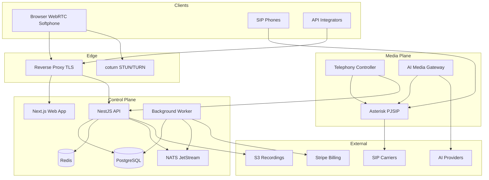

# Architecture

## Overview

## Planes

### Control plane

Manages tenants, users, configuration, billing metadata, and API access. Never holds active call media state.

### Media plane

Handles SIP sessions, RTP/WebSocket audio, bridges, recording streams, and AI audio pipelines.

## Monorepo layout

See [README.md](../README.md#repository-structure).

## Technology choices

| Component | Choice | Rationale |
|-----------|--------|-----------|
| API | NestJS + Fastify | Structured DI, OpenAPI, TypeScript |
| Web | Next.js | SSR, React ecosystem |
| AI gateway | Go | Low-latency concurrent audio |
| Telephony controller | Go | ARI reliability, concurrency |
| Database | PostgreSQL + Drizzle | RLS support, typed migrations |
| Events | NATS JetStream | Durable tenant-scoped subjects |
| Storage | S3-compatible | Recordings, exports |
| Observability | OpenTelemetry + Prometheus | Standard metrics/traces |

## Scale-out path

Documented in [TELEPHONY_ARCHITECTURE.md](./TELEPHONY_ARCHITECTURE.md). Kamailio + RTPengine front multiple Asterisk nodes; control plane remains shared; active call state stays on media nodes.

## Foundation stage deliverables

- Monorepo scaffolding
- Full data model schema
- Auth with JWT and permission checks
- Tenant guard (no client-supplied tenant trust)
- Tenant and extension APIs
- Health/readiness endpoints
- Local Docker infrastructure
