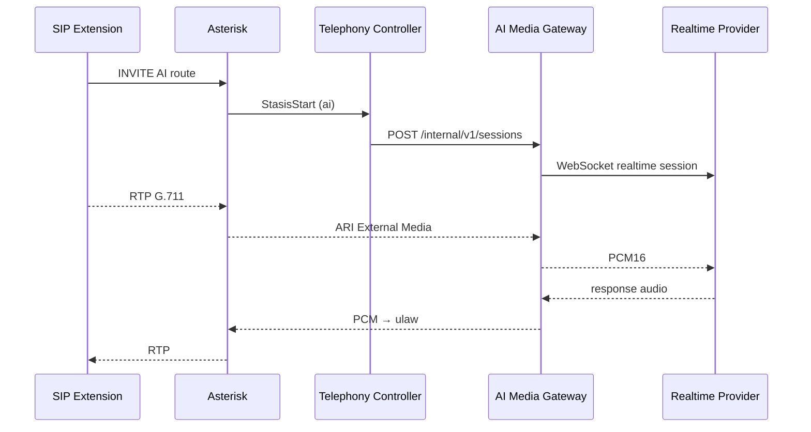

# Stage 8 — Realtime AI Voice Vertical Slice

**Status:** `STAGE8_STATUS: IN_PROGRESS` — deterministic External Media SIP path **PASS**; barge-in, tools, and human transfer **PASS** on deterministic provider; live OpenAI path not started.

## Prerequisite

`STAGE7_CLOSEOUT_GATE: PASS` — see [STAGE7_FINAL_EVIDENCE.md](./STAGE7_FINAL_EVIDENCE.md)

## Objective

Deliver inbound internal calls from a SIP extension to a tenant-owned AI voice agent with bidirectional realtime audio:

```text
SIP extension → Asterisk → ARI AI destination → AI media gateway → realtime provider → caller
```

## Implemented in this milestone (foundation)

| Component | Status |
|-----------|--------|
| Stage 7 regression harness | PASS |
| `packages/provider-sdk` contracts (`RealtimeVoiceProvider`, STT/LLM/TTS interfaces) | Expanded |
| `services/ai-media-gateway` Go service | Deterministic provider + health + test conversation endpoint |
| Docker compose `docker-compose.ai.yml` | Added |
| `make ai-up`, `ai-down`, `ai-test`, `stage8-*` | Added |
| DB schema (`ai_*` tables) | Pre-existing from foundation |
| Tenant AI REST APIs | **Not implemented** |
| Asterisk AI Stasis destination | **Implemented** (deterministic test route `8999`) |
| ARI External Media ↔ gateway RTP | **Implemented** (ulaw, bidirectional proof) |
| OpenAI Realtime / Gemini Live adapter | **Not implemented** |
| Human transfer / barge-in live proof | **Implemented** (deterministic provider, Slice 8.9) |

## Deterministic test provider

Local provider ID: `deterministic-test`

- Accepts PCM16 frames
- Emits predictable response audio and transcript strings
- Supports simulated delay and interruption cancellation
- Requires no external credentials
- **Not a production AI integration**

```bash
make ai-up
make stage8-test-deterministic
```

## Media architecture (planned)



Selected transport: **ARI External Media** (implemented for deterministic provider).

### Verified path (Slice 8.8)

```text
SIP (pbx-internal) → Asterisk AI route 8999 → Stasis → mixing bridge
  → UnicastRTP (client) ↔ ai-media-gateway:8091 RTP ↔ deterministic-test provider
```

Proof script: `bash scripts/stage8-sip-ai-deterministic-test.sh` → `STAGE8_DETERMINISTIC_SIP_AI: PASS`

### Verified path (Slice 8.9 — human transfer)

```text
AI caller (1001) → route 8997 → Stasis AI → External Media ↔ gateway
  → barge-in + transfer_call tool → originate PJSIP/ext_1002
  → INVITE → 180 → 200 → human Up → caller-human bridge → TRANSFERRED + usage
```

Proof scripts:

- `bash scripts/stage8-standalone-originate-test.sh` → `STAGE8_STANDALONE_ORIGINATE: PASS`
- `bash scripts/stage8-sip-ai-behavior-test.sh` → `STAGE8_DETERMINISTIC_BEHAVIOR: PASS`

## Next implementation steps

1. NestJS `/api/v1/ai/*` modules with encrypted provider credentials
2. Asterisk tenant AI dialplan + Stasis handler in telephony-controller
3. AI media gateway ↔ External Media bridge
4. OpenAI Realtime adapter (preferred when `OPENAI_API_KEY` present)
5. Barge-in, tool calls (`transfer_call`, `end_call`, `http_webhook`), human transfer — **deterministic proof done (8.9)**
6. AI session persistence + usage idempotency — **partial (platform meters on transfer)**
7. Live SIP proof script `make stage8-test-live`

## Verification

```bash
make stage8-verify          # Stage 7 regression + deterministic gateway (when up)
make stage8-test-live       # BLOCKED until live adapter exists
```

## Known limitations

- No invoice/charge calculation (by design for Stage 8)
- No PSTN, WebRTC, or Kamailio
- Provider credentials API not yet exposed
- Single-region local Docker only
