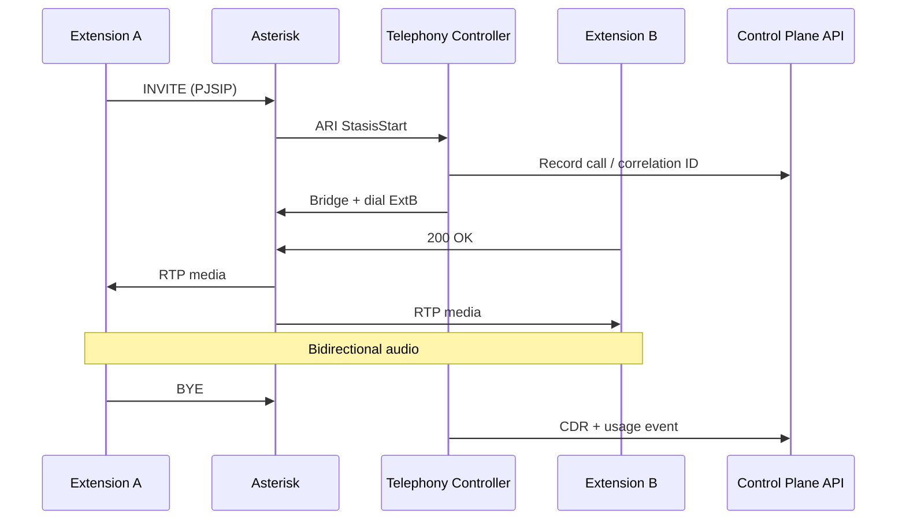
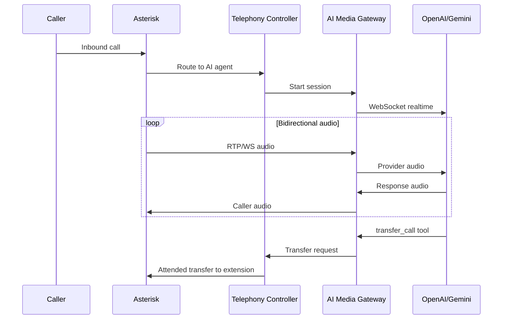
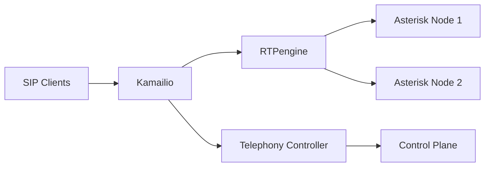

# Telephony Architecture

## Initial deployment (single node)

## Asterisk configuration

- **PJSIP** for endpoints, trunks, WebRTC
- **ARI** for programmatic call control (internal network only)
- **Tenant contexts**: `t_{slug}` — isolated dialplan per tenant
- **Resource naming**: `{slug}_ext_{number}`, `{slug}_trunk_{name}`

## Media paths

| Path | Transport | Use case |
|------|-----------|----------|
| Desk phone | SIP UDP/TCP/TLS + RTP/SRTP | Hardware phones |
| Browser softphone | SIP WSS + WebRTC | Tenant portal |
| AI agent | External Media / chan_websocket | Realtime AI audio |
| Carrier trunk | SIP + RTP | Inbound/outbound PSTN |

## AI call flow

## Scale-out architecture (future)

- Kamailio: registrar, dispatcher, tenant-aware routing
- RTPengine: media relay, transcoding at scale
- Consistent hashing by tenant for sticky routing
- Health checks and automatic failover
- No shared active call state across nodes

## Public ports (production)

| Port | Protocol | Purpose |
|------|----------|---------|
| 443 | TCP | Web, API, WSS |
| 5060 | UDP/TCP | SIP (restrict by provider IP where possible) |
| 5061 | TCP | SIP TLS |
| 10000-20000 | UDP | RTP |
| 3478 | UDP/TCP | TURN |
| 5349 | TCP | TURN TLS |

ARI (8088), AMI, PostgreSQL, Redis, NATS: **internal only**.

## Foundation stage status

Asterisk automation and ARI integration are **not yet implemented**. Schema and tenant-prefixed resource naming are in place.
