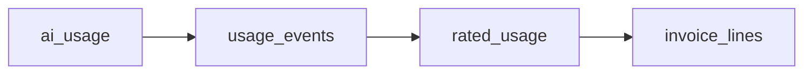

# Usage Metering

## Principles

- Immutable append-only `usage_events` ledger (source of truth for billing)
- Raw `ai_usage` is never modified; normalization copies into `usage_events`
- Invoices are built from `rated_usage`, not directly from editable CDR
- Idempotency keys prevent double-charging
- Integrity hash for tamper evidence

## Event fields

`id`, `idempotency_key`, `tenant_id`, `call_id`, `provider`, `resource_type`, `meter_name`, `quantity`, `unit`, timestamps, `source`, `dimensions`, `cost_metadata`, `correlation_id`, `integrity_hash`

## Supported meters (Slice D)

| Meter | Unit |
|-------|------|
| `internal_call_seconds` | seconds |
| `ai_realtime_session_seconds` | seconds |
| `ai_input_audio_seconds` | seconds |
| `ai_output_audio_seconds` | seconds |
| `ai_tool_calls` | count |
| `recording_seconds` | seconds |
| `recording_storage_bytes` | bytes |
| `api_requests` | count |

Meters without a configured price produce `rated_usage.rating_status = unrated` (visible, not a silent zero).

## Processing pipeline

```text
ai_usage ──normalize──► usage_events ──rate──► rated_usage ──invoice──► invoice_lines
```

1. **Normalize** — `ai-usage:{id}` idempotency key; copies platform-measured AI rows
2. **Rate** — selects price by `effective_from`/`effective_to` at event timestamp; stores `price_snapshot`
3. **Invoice** — aggregates rated usage by period; applies plan allowances, tax, credits



## Idempotency

- `usage_events.idempotency_key` — unique
- `rated_usage.usage_event_id` — unique (one rated row per event)
- `invoices.idempotency_key` — unique for generate

Re-rating skips already-rated events unless reprocessing unrated rows.

## Provider cost

Deterministic AI usage: `cost_metadata.providerCostStatus = UNAVAILABLE`. Customer charges use tenant price books only.

**Status:** Normalization and rating implemented in API. Async worker ingestion deferred.
